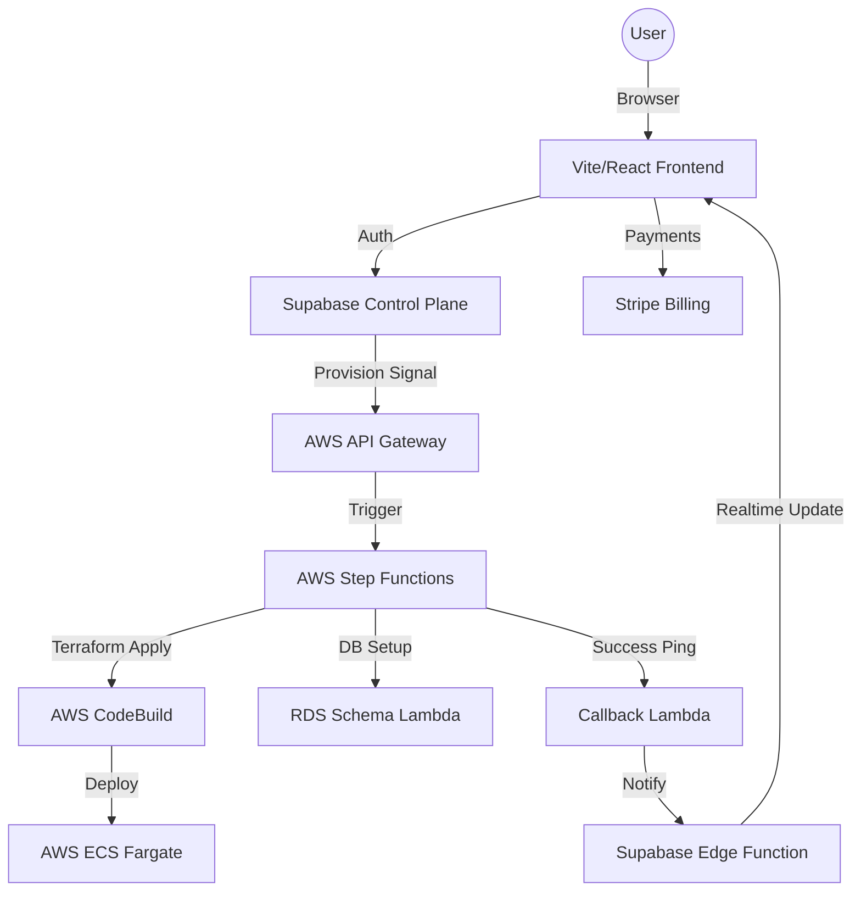

# NexScale Platform Architecture

NexScale is a multi-tenant SaaS platform that provides isolated, production-grade n8n instances on AWS infrastructure, managed by a Supabase-powered control plane.

## 1. High-Level Overview

The platform is split into two primary domains:
- **The Control Plane (Supabase + Stripe)**: Handles user authentication, subscription management, and workspace metadata.
- **The Data Plane (AWS)**: Orchestrates and hosts the actual containerized n8n workloads.

---

## 2. Component Breakdown

### A. Frontend (NexScale Web)
- **Tech Stack**: Vite, React, Tailwind-style Vanilla CSS.
- **Hosting**: AWS S3 Bucket + CloudFront Distribution.
- **Features**: 
    - Glassmorphic Dashboard.
    - Real-time provisioning terminal.
    - Stripe Checkout & Customer Portal integration.

### B. Control Plane (Supabase)
- **Database**: PostgreSQL (Managed schemas for `workspaces`).
- **Edge Functions**:
    - `verify-checkout`: Validates Stripe sessions and mints workspace records.
    - `create-portal-session`: Generates secure Stripe Billing Portal links.
    - `on-provision-success`: The terminal callback from AWS to finalize workspace activation.
- **Realtime**: Used to stream status changes and "Success" events back to the Dashboard.

### C. Infrastructure Orchestration (AWS)
- **API Gateway**: Secure REST entry point using Supabase JWT Authorizers.
- **Step Functions**: The "Brain" of the deployment.
    1. **Task 1 (CodeBuild)**: Dynamically generates a Terraform `.tf` file and runs `terraform apply -target=module.tenant_id`.
    2. **Task 2 (Lambda)**: Connects to the shared RDS instance and creates a dedicated Postgres Schema for the tenant.
    3. **Task 3 (Lambda)**: Pings the Supabase Edge Function to mark the workspace as `active`.
- **ECS Fargate**: Hosts the n8n containers. Each tenant gets a dedicated task with isolated CPU/RAM.
- **ALB (Application Load Balancer)**: Uses Host-based routing (e.g., `tenant-a.n8n.trybase.io`) to forward traffic to the correct ECS service.

### D. External Services
- **Stripe**: Handles the subscription lifecycle (Starter/Pro/Business).
- **Resend**: Triggers transactional emails when provisioning is complete.

---

## 3. Data Isolation Model

| Layer | Isolation Strategy |
| :--- | :--- |
| **Compute** | Dedicated ECS Fargate Task per tenant. |
| **Network** | Traffic isolated via ALB Listener Rules and Security Groups. |
| **Database** | Separate PostgreSQL Schemas (`CREATE SCHEMA`) on a shared RDS cluster. |
| **Secrets** | Tenant-specific entries in AWS Secrets Manager. |

---

## 4. Key Provisioning Workflow

1.  **Selection**: User selects a plan on the Home page and completes Stripe Checkout.
2.  **MINT**: Stripe redirects to the Dashboard; `verify-checkout` creates an `unprovisioned` workspace record.
3.  **Claim**: User chooses a slug (e.g., `agile-fox-jumps`). Dashboard calls AWS `/provision`.
4.  **Build**: AWS CodeBuild runs Terraform to spin up the ECS Service and ALB Rules.
5.  **Schema**: Lambda creates the corresponding Postgres schema.
6.  **Callback**: Step Function hits `on-provision-success`.
7.  **Live**: Supabase Realtime notifies the UI; user gets a "Ready" email via Resend.

---

## 5. Security & Auth

- **JWT Cross-Pollination**: We use the Supabase JWT directly in AWS API Gateway to verify that the person requesting a `/provision` call is the actual owner of the account.
- **Secret Management**: No database passwords or Stripe keys are stored in the frontend; all sensitive operations happen in Supabase Edge Functions or AWS Lambdas using IAM roles.
